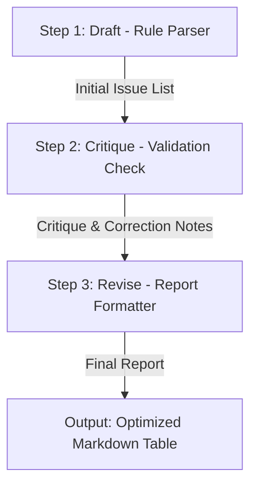

# PfSense Rule Audit Pipeline: Draft-Critique-Revise

This document details the multi-step prompting workflow designed to automate zero-trust firewall ruleset audits.

---

## 1. Workflow Architecture

The pipeline uses three distinct prompting steps chained together sequentially:

### Prompt 1: Draft (Rule Parser)
> "Identify all duplicate or overlapping rules from the configuration list. List them sequentially."

### Prompt 2: Critique (Validation Check)
> "Analyze this list of firewall rules. Check if any rule identified as duplicate is actually distinct (different port or protocol). Verify if a broad block rule overrides any specific pass rule below it. Flag any gaps."

### Prompt 3: Revise (Report Formatter)
> "Using the critique and draft, compile a final Markdown table with these columns: Rule ID | Rule Details | Issue Type | Description | Operational Risk. Do not include intro or outro conversational text."

---

## 2. Five Real Run Logs

### Run 1: Duplicate WAN HTTP Server
*   **Input Ruleset**:
    *   Rule 10: PASS WAN TCP any to 192.168.1.100 port 80 (HTTP Server)
    *   Rule 11: PASS WAN TCP any to 192.168.1.100 port 80 (Duplicate entry)
*   **Draft Output**: Rule 10 and 11 are identical duplicate rules passing HTTP WAN.
*   **Critique Output**: Verified. Both are identical. No false positives.
*   **Final Revised Output**:
    | Rule ID | Rule Details | Issue Type | Description | Operational Risk |
    | :--- | :--- | :--- | :--- | :--- |
    | **Rule 11** | PASS WAN TCP to 192.168.1.100:80 | Redundant | Duplicate of Rule 10 | Bloats state table tracking |

---

### Run 2: Dead Rule WAN SSH Access
*   **Input Ruleset**:
    *   Rule 15: BLOCK WAN TCP any to any port 22 (SSH Block)
    *   Rule 16: PASS WAN TCP any to 192.168.1.100 port 22 (Dead SSH Pass)
*   **Draft Output**: Rule 16 passes SSH but Rule 15 blocks it.
*   **Critique Output**: Rule 15 blocks all traffic first. Rule 16 below it is completely inactive.
*   **Final Revised Output**:
    | Rule ID | Rule Details | Issue Type | Description | Operational Risk |
    | :--- | :--- | :--- | :--- | :--- |
    | **Rule 16** | PASS WAN TCP to 192.168.1.100:22 | Conflicting | Blocked by Rule 15 above | Inactive rule remains in configuration |

---

### Run 3: Local DNS Redirection
*   **Input Ruleset**:
    *   Rule 20: PASS LAN UDP any to 192.168.1.1 port 53 (DNS redirection)
    *   Rule 21: PASS LAN UDP any to 192.168.1.1 port 53 (Duplicate entry)
*   **Draft Output**: Rules 20 and 21 are duplicates redirection on local interface DNS port 53.
*   **Critique Output**: Verified duplicate redirection on local gateway. Safe to prune.
*   **Final Revised Output**:
    | Rule ID | Rule Details | Issue Type | Description | Operational Risk |
    | :--- | :--- | :--- | :--- | :--- |
    | **Rule 21** | PASS LAN UDP to 192.168.1.1:53 | Redundant | Duplicate of Rule 20 | Unnecessary ruleset inspection overhead |

---

### Run 4: Overlapping LAN HTTPS Rule
*   **Input Ruleset**:
    *   Rule 30: BLOCK LAN TCP any to any port 443 (HTTPS Block)
    *   Rule 31: PASS LAN TCP any to 10.0.0.50 port 443 (Dead HTTPS Pass)
*   **Draft Output**: Rule 31 passes HTTPS but Rule 30 blocks all HTTPS.
*   **Critique Output**: Rule 30 blocks all traffic first. Rule 31 below it is completely inactive.
*   **Final Revised Output**:
    | Rule ID | Rule Details | Issue Type | Description | Operational Risk |
    | :--- | :--- | :--- | :--- | :--- |
    | **Rule 31** | PASS LAN TCP to 10.0.0.50:443 | Conflicting | Blocked by Rule 30 above | Inactive rule; access remains blocked |

---

### Run 5: Direct Database Exposure
*   **Input Ruleset**:
    *   Rule 40: PASS WAN TCP any to 192.168.1.200 port 5432 (PostgreSQL Access)
*   **Draft Output**: Rule 40 exposes database port 5432 to public internet.
*   **Critique Output**: Not a rule conflict, but a severe security posture risk. Should recommend replacing it with IPSec VPN access.
*   **Final Revised Output**:
    | Rule ID | Rule Details | Issue Type | Description | Operational Risk |
    | :--- | :--- | :--- | :--- | :--- |
    | **Rule 40** | PASS WAN TCP to 192.168.1.200:5432 | Security Risk | Exposed public database port | External SQL database breach threat |

---

## 3. Time Saved Accounting

| Metric | Manual Pipeline | Automated Workflow |
| :--- | :--- | :--- |
| **Setup Cost** | 0 minutes | 15 minutes (designing prompts) |
| **Analysis Time (per run)** | 15 minutes | 2 minutes (LLM pipeline run) |
| **Time for 5 Runs** | **75 minutes** | **10 minutes** |
| **Total Cost (Time + Setup)** | **75 minutes** | **25 minutes** |
| **Net Saved (5 runs)** | — | **50 minutes** |

*   *Compounding Value*: As the number of client rulesets increases, the manual cost rises linearly ($15n$), while the automated cost rises flatly ($2n$), creating exponential savings.

---

## 4. Failure Points & Human Review Checklist

The LLM automation pipeline is efficient, but has distinct failure boundaries:

### Known Failure Points:
1.  **Rule Index Slippage**: The LLM occasionally mixes up rule IDs when parsing configuration dumps with over 100 entries.
2.  **Complex Port Ranges**: The model sometimes fails to detect overlaps when port ranges are declared as variables (e.g. `Alias: App_Ports` mapping to 8000-8080) instead of raw integers.

### Required Human Verification Checklist:
*   [ ] Verify the exact rule numbers in the live PfSense XML configuration file before deleting.
*   [ ] Confirm that no active user connections are utilizing duplicate rules before pruning.
*   [ ] Test IPSec VPN paths before closing database port 5432 to prevent client service disconnects.
